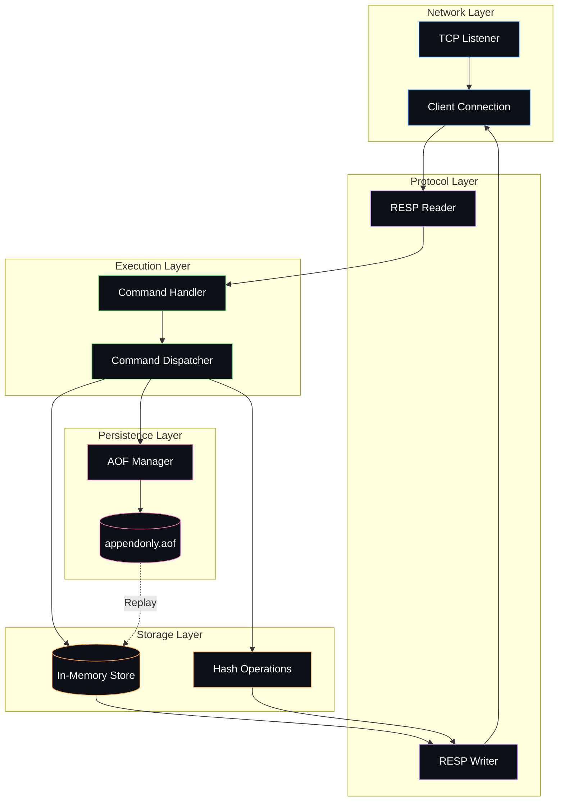
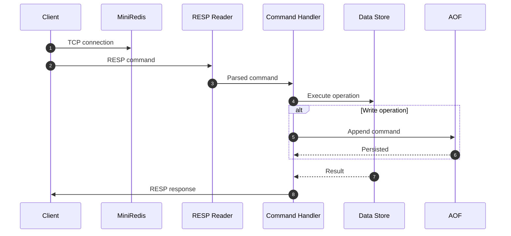
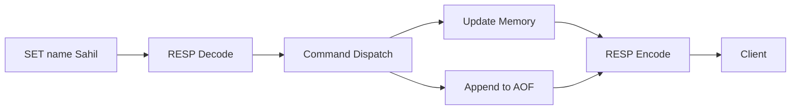
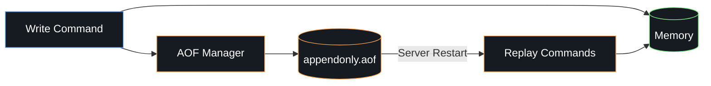
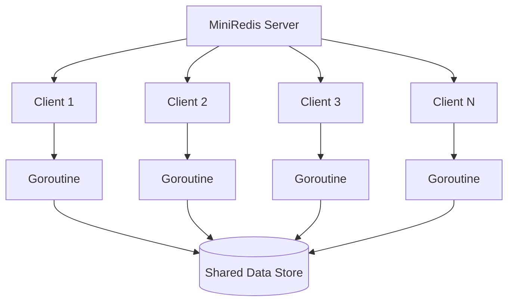
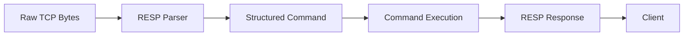

# MiniRedis

> A lightweight Redis-compatible in-memory database built from scratch in Go.

MiniRedis is a from-scratch implementation of a Redis-style key-value database server, designed to explore the internals behind networked databases.

It implements a TCP server, RESP protocol parsing, concurrent client handling, in-memory data structures, Redis-style commands, and Append Only File (AOF) persistence.

The project focuses on understanding the systems underneath a database rather than treating the database as a black box.

---

## Overview

MiniRedis follows the same fundamental architecture used by networked in-memory databases:


A client communicates with the server over TCP using the RESP protocol. Requests are parsed, dispatched to the appropriate command handler, executed against the in-memory store, and returned to the client as RESP responses.

Write operations are additionally recorded in the AOF so that the database state can be reconstructed after a restart.

---

## Key Features

* TCP database server
* RESP protocol parser and serializer
* Concurrent client handling using Go goroutines
* In-memory key-value storage
* String data type
* Hash data type
* Redis-style command execution
* Append Only File persistence
* Database recovery through AOF replay
* Modular and minimal codebase
* Compatible with Redis-style clients for supported commands

---

## Architecture

The server is intentionally divided into small components with clear responsibilities.



### Component Responsibilities

| Component          | Responsibility                           |
| ------------------ | ---------------------------------------- |
| TCP Listener       | Accepts incoming client connections      |
| RESP Reader        | Parses client requests                   |
| Command Handler    | Processes individual client requests     |
| Command Dispatcher | Routes commands to their implementations |
| In-Memory Store    | Maintains active database state          |
| RESP Writer        | Encodes responses sent to clients        |
| AOF Manager        | Persists write operations                |
| AOF File           | Stores commands required for recovery    |

---

## Request Lifecycle

Every client request follows a simple execution pipeline:



For example:

```text
SET name Sahil
```

becomes:



---

## Persistence

MiniRedis uses an **Append Only File (AOF)** approach for basic durability.

Instead of periodically writing the complete database state to disk, write operations are appended to a log.



### Recovery

When the server starts:

1. Open the AOF file.
2. Read previously persisted commands.
3. Parse each command.
4. Replay the commands against the in-memory store.
5. Restore the database state.

This provides persistence while keeping the runtime data path entirely in memory.

---

## Concurrency Model

Each client connection is handled independently using a Go goroutine.



This allows multiple clients to interact with the server concurrently without creating a separate process for each connection.

---

## RESP Protocol

MiniRedis implements the core concepts of the **Redis Serialization Protocol (RESP)**.

A command such as:

```text
SET name Sahil
```

is transmitted in RESP form:

```text
*3
$3
SET
$4
name
$5
Sahil
```

The server parses the byte stream, converts it into a structured command, executes it, and serializes the result back into RESP.



---

## Supported Data Types

### Strings

Basic key-value operations:

```text
SET name Sahil
GET name
DEL name
```

### Hashes

Store multiple fields under a single key:

```text
HSET user name Sahil
HGET user name
```

The command set can be extended as the database evolves.

---

## Project Structure

```text
.
├── main.go          # Server initialization and startup
├── handler.go       # Client handling and command execution
├── resp.go          # RESP protocol reader/writer
├── aof.go           # Append Only File persistence
├── go.mod           # Go module definition
└── README.md
```

The implementation intentionally keeps the codebase small so that each major database component can be understood independently.

---

## Getting Started

### Requirements

* Go 1.20+
* Git
* Optional: `redis-cli`

### Clone

```bash
git clone https://github.com/<your-username>/miniredis.git
cd miniredis
```

### Run

```bash
go run .
```

### Build

```bash
go build -o miniredis .
```

Run the compiled binary:

```bash
./miniredis
```

---

## Usage

If the server is running on the default Redis port, connect using:

```bash
redis-cli
```

Then execute supported commands:

```text
127.0.0.1:6379> SET name Sahil
OK

127.0.0.1:6379> GET name
"Sahil"

127.0.0.1:6379> HSET user name Sahil
(integer) 1

127.0.0.1:6379> HGET user name
"Sahil"
```

---

## Design Goals

MiniRedis was built to understand the internal mechanics of a database server.

The project explores:

* TCP networking
* Client-server architecture
* Binary/text protocol design
* Protocol parsing
* Serialization
* Concurrent request handling
* In-memory data structures
* Command dispatch
* Persistence
* Crash recovery
* Database server architecture

Rather than hiding these concepts behind libraries, MiniRedis implements the core components directly.

---

## Roadmap

Potential future improvements:

* [ ] Additional Redis commands
* [ ] Lists
* [ ] Sets
* [ ] Sorted sets
* [ ] TTL and key expiration
* [ ] Transactions
* [ ] Pub/Sub
* [ ] Request pipelining
* [ ] AOF rewriting
* [ ] Graceful shutdown
* [ ] Configuration system
* [ ] Automated unit and integration tests
* [ ] Benchmarking
* [ ] Improved concurrency and synchronization
* [ ] Memory usage optimizations

---

## Tech Stack

```text
Language       Go
Networking     TCP
Protocol       RESP
Persistence    Append Only File
Concurrency    Goroutines
Storage        In-Memory
Client         redis-cli / RESP-compatible clients
```

---

## What This Project Demonstrates

MiniRedis demonstrates practical experience with low-level backend and systems concepts including:

* Network programming
* Concurrent server design
* Protocol implementation
* Data structure design
* Persistence mechanisms
* State recovery
* Request/response architectures
* Go concurrency primitives
* Database internals

---

## License

* [ ] This project is licensed under the MIT License.
